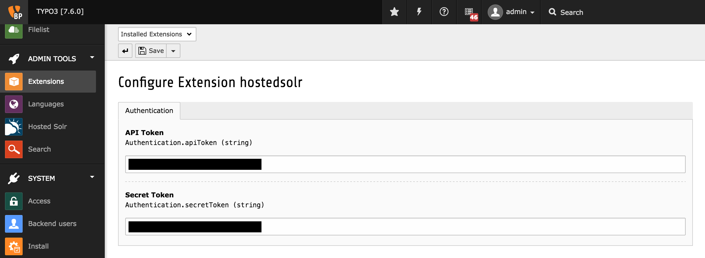

.. ==================================================
.. FOR YOUR INFORMATION
.. --------------------------------------------------
.. -*- coding: utf-8 -*- with BOM.

.. include:: ../Includes.tx¸t

.. _admin-manual:

Administrator Manual
====================

Target group: **Administrators**

Describes how to manage the extension from an administrator point of view.

.. _admin-installation:

Installation
------------
**Step 1: API credentials**

The authentication requires two parameters: api_token and secret_token. You can access these on the page API.

**Step 2: Extension Configuration**

You have to set those two parameters in the Configuration-Area of the Hostedsolr-Extension.

   Configuration of Hostedsolr-Extension (caption of the image)

.. _admin-configuration:
