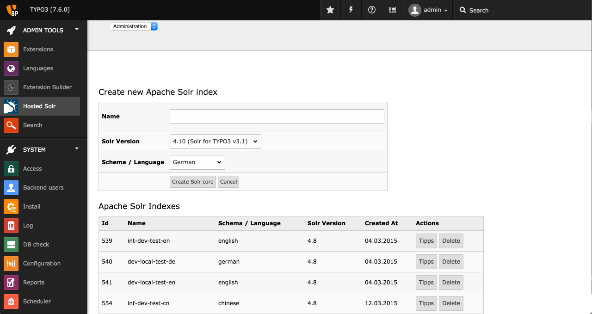
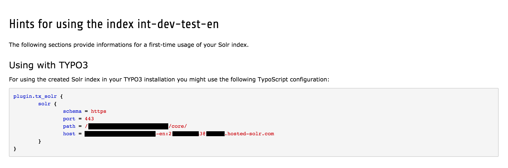

.. ==================================================
.. FOR YOUR INFORMATION
.. --------------------------------------------------
.. -*- coding: utf-8 -*- with BOM.

.. include:: ../Includes.txt

.. _introduction:

Introduction
============

.. _what-it-does:

What does it do?
----------------

Hostedsolr for TYPO3 is an client for wwww.hosted-solr.com service.
You can manage your Hostedsolr account with this extension via the TYPO3 backend.

.. _screenshots:

Screenshots
-----------

In this CRUD-List-View (Create, Read, Update, Delete) you can manage your hostedsolr account inside your TYPO3 installtion.

   Hostedsolr-Ext List-View

In the detail-view ("Tipp"-Button) you can see the required TypoScript configuration to use the solr-core.

Hostedsolr Core Detail-View
